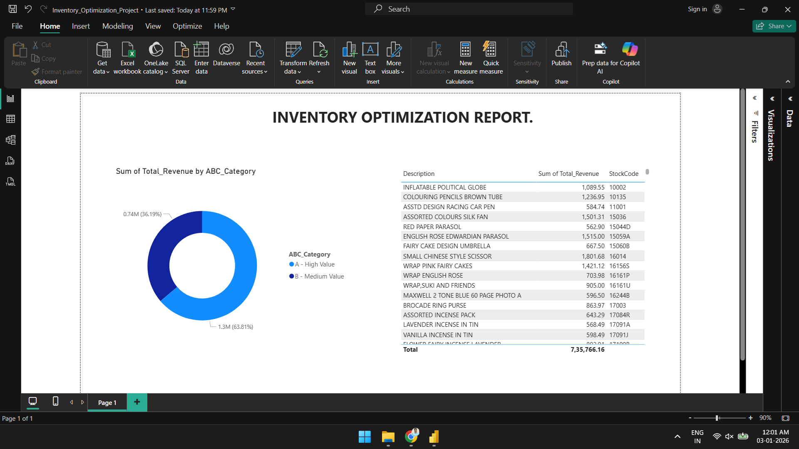
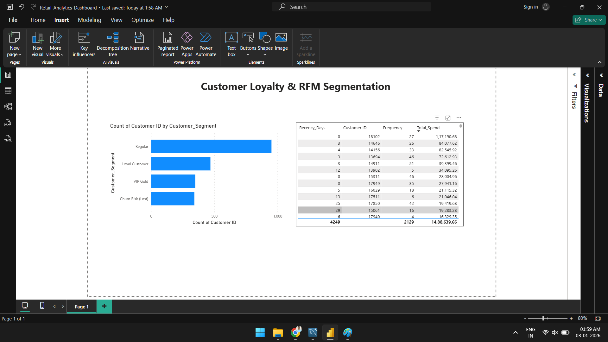

# 🛒 Retail Supply Chain & Customer Loyalty Analytics

## 📌 Project Overview
This project solves two critical problems in retail management: **Inventory Efficiency** and **Customer Retention**. 

Using a dataset of 500,000+ transactions, I built an end-to-end analytics solution that:
1.  **Optimizes Inventory:** Uses **ABC Analysis** to identify high-value products.
2.  **Improves Loyalty:** Uses **RFM Segmentation** to classify customers into VIPs, Loyalists, and Churn Risks.

---

## 📊 Dashboard Previews

### 1️⃣ Inventory Analysis (ABC Method)
*Identifies that Class A products contribute 80% of revenue but only 20% of stock.*

### 2️⃣ Customer Segmentation (RFM Method)
*Segments users based on Recency, Frequency, and Monetary value to target marketing campaigns.*

---

## 🛠️ The Process & Logic

### 🔹 Phase 1: Inventory Optimization (ABC Analysis)
**Goal:** Determine which products to stock heavily and which to cut.
* **Method:** Calculated cumulative revenue percentage for each SKU.
* **Logic:**
    * **Class A (High Value):** Top 80% of revenue (Critical stock).
    * **Class B (Medium Value):** Next 15% of revenue.
    * **Class C (Low Value):** Bottom 5% of revenue (Candidate for clearance).
* **SQL Technique:** Used Window Functions (`SUM() OVER(ORDER BY...)`) to calculate running totals.

### 🔹 Phase 2: Customer Loyalty (RFM Segmentation)
**Goal:** Identify VIP customers and those at risk of leaving.
* **Method:** Scored every customer on 1-5 scale for:
    * **Recency:** How many days since last purchase?
    * **Frequency:** How many times did they buy?
    * **Monetary:** How much did they spend?
* **SQL Technique:** Used `NTILE(5)` to automate the scoring groups.

---

## 📂 File Structure
| File Name | Description |
| :--- | :--- |
| `Retail_Analytics_Dashboard.pbix` | **The Main Project File.** Interactive Power BI dashboard with navigation. |
| `ABC Analysis.sql` | SQL script for Inventory classification logic. |
| `customer_rfm_analysis.sql` | SQL script for Customer Segmentation logic. |
| `final_abc_data.csv` | Processed data output for inventory page. |
| `customer_rfm_data.csv` | Processed data output for customer page. |
| `archive/online_retail_II.csv` | Raw transaction dataset (Source). |

---

## 🚀 Key Insights
* **Inventory Imbalance:** A small percentage of unique items ("Class A") drive the vast majority of revenue. Out-of-stock events here would be catastrophic.
* **Churn Risk:** A significant portion of the customer base has high past spending but high "Recency" (hasn't bought lately), indicating a need for a re-engagement email campaign.

---

## 👤 Author
**Shreyash Mungase** *Data Analyst | SQL | Power BI | Python* [LinkedIn](https://www.linkedin.com/in/shreyash-mungase/) | [GitHub](https://github.com/Shreyash9595)
